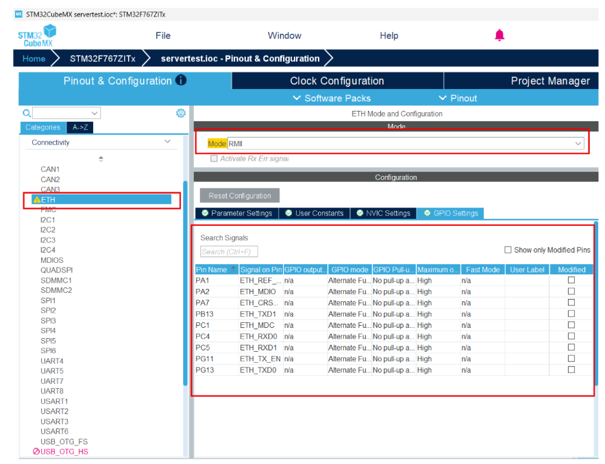
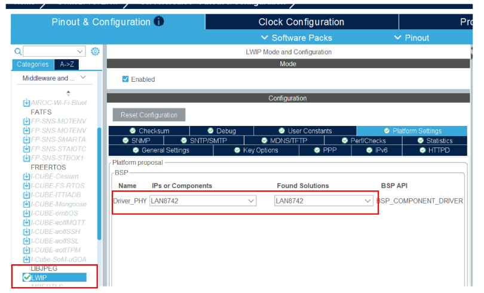
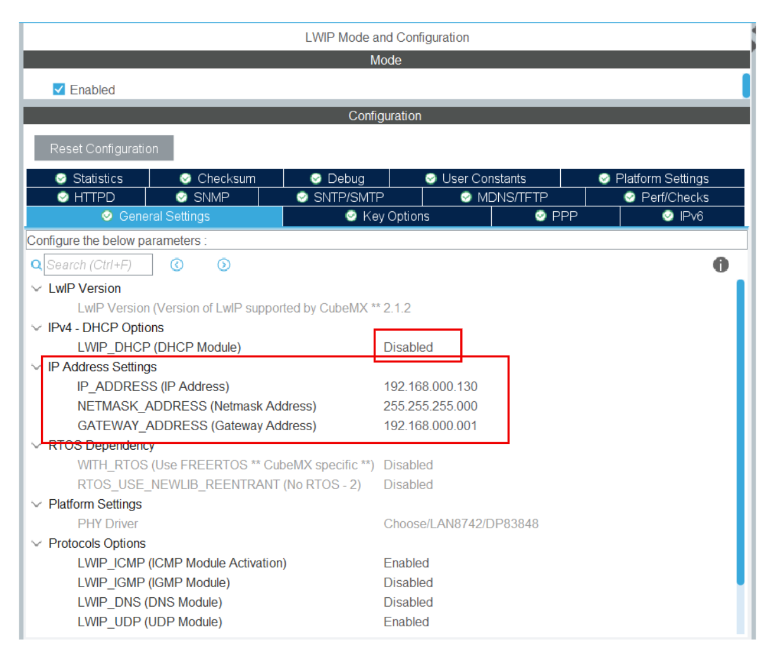
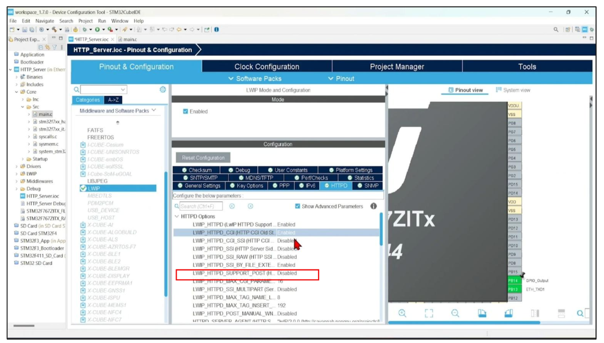
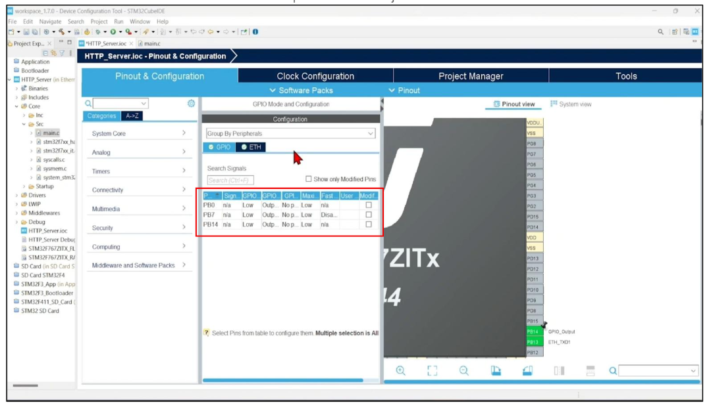
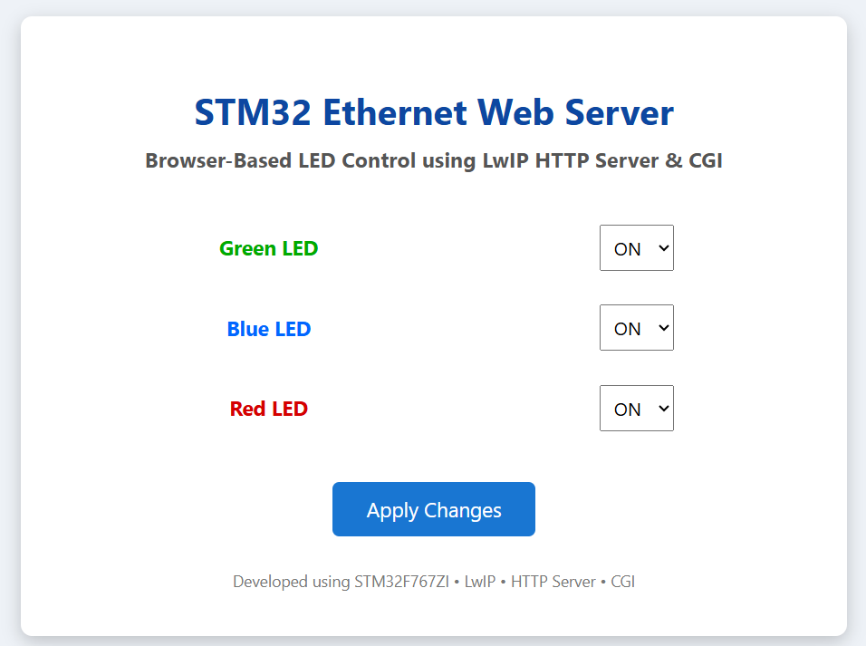
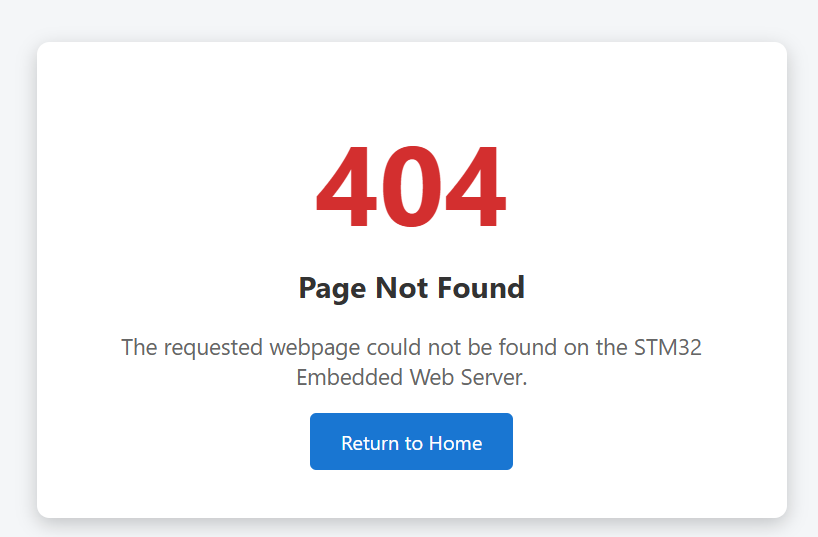
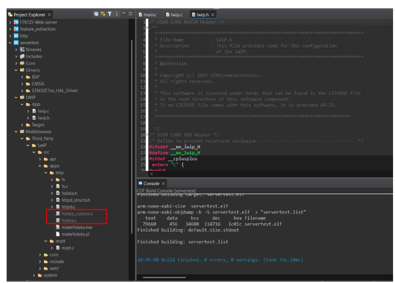
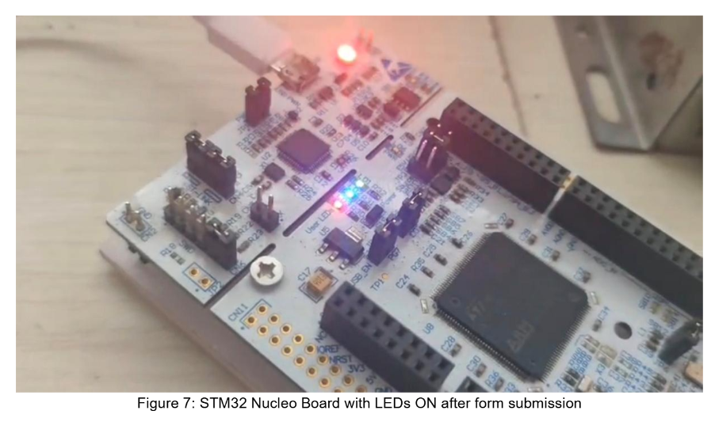

# STM32F767ZI Ethernet Web Server

## About Me

**Name:** S VIDISHA

**College:** Sahyadri College of Engineering and Management

**Email ID:** vidisha.ec23@sahyadri.edu.in

### LinkedIn

[](YOUR_LINKEDIN_LINK)

---

## About the Project

This project demonstrates the implementation of an **Embedded Ethernet Web Server** using the **STM32F767ZI Nucleo-144** development board.

The web server is developed using the **LwIP TCP/IP stack** and **HTTP Server middleware** provided by STM32CubeMX. A browser-based graphical interface allows users to control the onboard LEDs using the **Common Gateway Interface (CGI)**.

The project covers the complete workflow from Ethernet configuration to serving HTML pages and processing HTTP requests.

---

## Features

- Embedded HTTP Server
- Ethernet Communication using LAN8742 PHY
- Browser-Based LED Control
- CGI (Common Gateway Interface)
- Static IP Configuration
- HTML Web Interface
- Embedded File System using Perl (makefsdata)
- Developed using STM32CubeIDE & STM32CubeMX

---

## Hardware Used

| Component | Description |
|-----------|-------------|
| STM32F767ZI Nucleo-144 | Development Board |
| LAN8742 PHY | Ethernet Interface |
| Ethernet Cable | Network Connection |
| Router | Local Network |
| Laptop/PC | Web Browser |

---

## Software Used

- STM32CubeIDE
- STM32CubeMX
- LwIP Middleware
- Embedded C
- Perl
- HTML & CSS

---

## Project Workflow

```
                User
                 │
                 ▼
        Web Browser (HTTP)
                 │
        HTTP GET Request
                 │
                 ▼
         Local Router / LAN
                 │
                 ▼
     STM32F767ZI Nucleo-144
                 │
        Ethernet (LAN8742 PHY)
                 │
                 ▼
         LwIP TCP/IP Stack
                 │
                 ▼
        Embedded HTTP Server
                 │
                 ▼
        CGI Request Handler
                 │
                 ▼
      STM32 HAL GPIO Driver
                 │
                 ▼
      Onboard LEDs (PB0, PB7, PB14)
```

---

<details>

<summary><b>1. Creating the STM32CubeIDE Project</b></summary>

## Project Initialization

The project was created using **STM32CubeIDE** by selecting the **STM32F767ZI Nucleo-144** development board.

STM32CubeMX was then used to configure the peripherals and automatically generate the initialization code.

### Steps

1. Open STM32CubeIDE.
2. Select **File → New STM32 Project**.
3. Choose **STM32F767ZI Nucleo-144**.
4. Create the project.
5. Save the `.ioc` file.
6. Generate the initialization code.

</details>

---

<details>

<summary><b>2. Configuring the Ethernet Peripheral</b></summary>

The Ethernet peripheral was configured in **RMII Mode** to enable communication through the onboard **LAN8742 Ethernet PHY**.

The following Ethernet interface pins were configured automatically by STM32CubeMX.

| Pin | Function |
|------|----------|
| PA1 | REF_CLK |
| PA2 | MDIO |
| PC1 | MDC |
| PA7 | CRS_DV |
| PC4 | RXD0 |
| PC5 | RXD1 |
| PG11 | TX_EN |
| PG13 | TXD0 |
| PB13 | TXD1 |

### Ethernet Configuration



</details>

---

<details>

<summary><b>3. Configuring the LwIP TCP/IP Stack</b></summary>

The **LwIP middleware** was enabled to provide TCP/IP networking support.

The onboard **LAN8742 PHY** was selected as the Ethernet driver.

DHCP was disabled and a **Static IP Address** was assigned so that the embedded web server could always be accessed using the same IP address.

### LwIP PHY Configuration



### Static IP Configuration



### Network Parameters

| Parameter | Value |
|------------|-------|
| IP Address | 192.168.0.130 |
| Subnet Mask | 255.255.255.0 |
| Gateway | 192.168.0.1 |

</details>

---

<details>

<summary><b>4. Configuring the HTTP Server and GPIO</b></summary>

The **HTTP Server** was enabled within the LwIP middleware.

CGI support was also enabled to allow the browser to send HTTP requests to the STM32 firmware.

The onboard LEDs were configured as GPIO outputs.

### HTTP Server & CGI Configuration



### GPIO Configuration



| GPIO Pin | LED |
|-----------|-----|
| PB0 | Green LED |
| PB7 | Blue LED |
| PB14 | Red LED |

</details>

---

<details>

<summary><b>5. Designing the Embedded Web Interface</b></summary>

A lightweight HTML interface was created to allow users to remotely control the onboard LEDs through a web browser.

The webpage provides independent ON/OFF controls for each LED.

### Features

- Green LED Control
- Blue LED Control
- Red LED Control
- Browser-Based Interface
- HTTP GET Request Submission

### LED Control Webpage



### Custom 404 Error Page

A custom error page was also created to improve the user experience whenever an invalid URL is accessed.



</details>

---

<details>

<summary><b>6. Implementing the CGI Handler</b></summary>

The Common Gateway Interface (CGI) processes HTTP GET requests received from the browser.

Each parameter is parsed and mapped to the corresponding LED state.

Example Request

```text
LEDControl.cgi?green=ON&blue=OFF&red=ON
```

The CGI handler updates the LED status using STM32 HAL GPIO functions.

Workflow:

```
Browser
      │
HTTP GET Request
      │
HTTP Server
      │
CGI Handler
      │
HAL_GPIO_WritePin()
      │
LED Output
```

</details>

---

<details>

<summary><b>7. Generating the Embedded Filesystem</b></summary>

The LwIP HTTP Server cannot directly serve HTML files.

The **makefsdata.pl** Perl script converts the HTML pages into embedded C arrays.

Generated Files

- fsdata.c
- fsdata_custom.c

These generated source files were copied into

```
Middlewares
└── Third_Party
    └── LwIP
        └── src
            └── apps
                └── http
```

### Embedded Filesystem



</details>

---

<details>

<summary><b>8. Building and Flashing the Firmware</b></summary>

### Build

Compile the project using **STM32CubeIDE**.

Ensure that there are no compilation errors before flashing.

### Flash

Program the firmware into the STM32F767ZI using the onboard **ST-LINK** debugger.

### Hardware Setup

- Connect the STM32 board to the router using an Ethernet cable.
- Connect the PC to the same network.
- Restart the STM32 board.

</details>

---

<details>

<summary><b>9. Testing the Embedded Web Server</b></summary>

Open any web browser and enter

```text
http://192.168.0.130
```

The browser loads the embedded web interface served directly from the STM32 Flash memory.

Select the required LED states and click **Apply Changes**.

The CGI handler receives the request and updates the onboard LEDs immediately.

### Browser Output


### Hardware Output



</details>

---

---

## Folder Structure

```
STM32F767ZI-Ethernet-WebServer
│
├── Core
├── Drivers
├── Middlewares
├── LWIP
├── HTML
├── README.md
└── STM32F767ZI.ioc
```

---

## Learning Outcomes

- STM32 Ethernet Peripheral Configuration
- LwIP TCP/IP Stack
- HTTP Protocol
- Common Gateway Interface (CGI)
- Embedded Web Server Development
- STM32CubeMX
- STM32CubeIDE
- HTML Integration
- Embedded File System
- GPIO Control through HTTP

---

